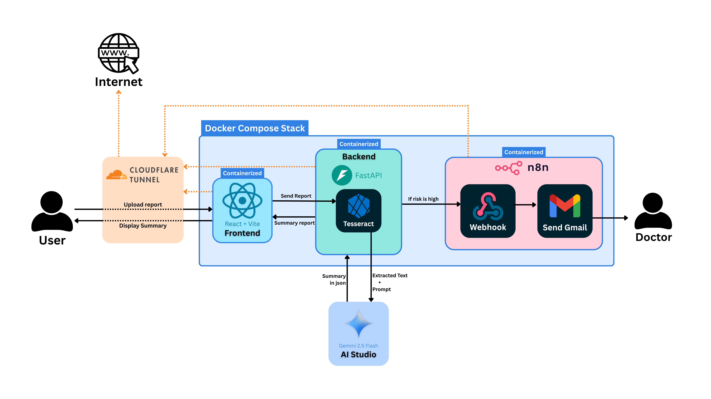

# UNDER PROGRESS!!!

# AI Based Medical Report Analyzer


This portfolio project demonstrates my ability to design and develop end-to-end AI applications by integrating modern frontend technologies, backend APIs, OCR pipelines, Large Language Models (LLMs), workflow automation, and cloud-native deployment practices.

This AI - Automation system allows users to upload medical reports, automatically extracts text using Tesseract OCR, analyzes the report using Google's Gemini AI model, generates structured medical insights, and triggers automated notifications for high-risk cases through n8n workflows.

## Workflow

<p align="center">
  
</p>

## Portfolio Highlights

This project showcases expertise in:

- Full-Stack Application Development
- AI-Powered Document Processing
- OCR Integration
- Prompt Engineering
- REST API Development
- Workflow Automation using n8n
- Event-Driven Architecture
- Docker & Containerization
- Cloudflare Tunnel Deployment
- AI System Integration
- Enterprise Application Architecture

## Why I Built This

Medical reports often contain complex information that can be difficult for patients to interpret quickly. This project explores how AI can assist in extracting meaningful insights from medical documents and automate alerting workflows for potentially high-risk cases.

## Key Skills Demonstrated
  
| Category | Skills Demonstrated| 
| --- | --- |
| Frontend | React, Vite, Axios |
| Backend	| FastAPI, Python, REST APIs |
| AI/ML |Gemini API, Prompt Engineering |
| OCR |	Tesseract OCR |
| Automation |n8n, Webhooks |
| DevOps | Docker, Docker Compose |
| Networking | Cloudflare Tunnel |
| Development | Git, GitHub, VS Code |

## How It Works

1. Report Upload

Users upload a medical report through the React-based web interface.

2. OCR Processing

The backend receives the report and uses Tesseract OCR to extract textual information from the document.

3. AI Analysis

The extracted text is sent to the Gemini 2.5 Flash API with a carefully engineered prompt.

- The AI model generates:

    - Patient Summary
    - Key Findings
    - Abnormal Parameters
    - Risk Assessment
    - Recommendations
4. Structured Response

The response is converted into a structured JSON format and returned to the frontend.

5. Alert Generation

If the AI determines that the patient's condition is high-risk:

Backend triggers an n8n webhook
n8n executes an automation workflow
Email notification is sent to the designated doctor \

## Dockerized Deployment

All major services run inside Docker containers:
```bash
Docker Compose Stack
│
├── Frontend Container
├── Backend Container
└── n8n Container
```
- Benefits:

    - Simplified deployment
    - Environment consistency
    - Easy scaling
    - Service isolation
    - Portable infrastructure
## Cloudflare Tunnel Integration

Cloudflare Tunnel is used to expose services securely without directly opening ports on the server.

- Configured Public Endpoints:

    - Frontend Domain
    - Backend API Domain
    - n8n Workflow Domain

- Benefits:

    - Secure remote access
    - HTTPS by default
    - No port forwarding required
    - Simplified networking
## Project Structure
```bash
medical-ai-analyzer/
│
├── assets/
├── backend/
│   ├── .dockerignore
│   ├── app.py
│   ├── Dockerfile
│   ├── gemini_agent.py
│   ├── ocr.py
│   └── requirements.txt
├── frontend/
│   ├── public/
│   ├── src/
│   │   ├── assets/
│   │   ├── App.css
│   │   ├── App.jsx
│   │   ├── index.css
│   │   ├── main.jsx
│   ├── Dockerfile
│   ├── eslint.config.js
│   ├── index.html
│   ├── package-lock.json
│   ├── package.json
│   ├── README.md
│   ├── vite.config.js
├── .gitignore
├── docker-compose.yml
└── README.md
```