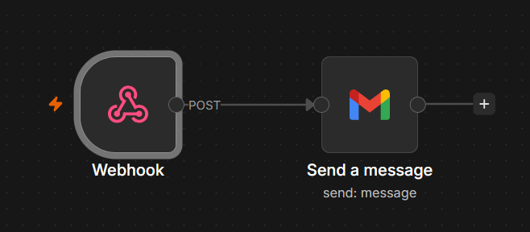

# Installation

## Setup Docker

To install Docker on your system, follow the official guide [here](https://docs.docker.com/engine/install/)


If Docker CLI feels overwhelming, try [Portainer](https://docs.portainer.io/start/install-ce/server/docker/linux) which allows you to manage containers, volumes, networks, etc via GUI.

## Setup Cloudflared

Refer this section only if you want to expose this application to the internet.

Follow the official guide to setup cloudflared on your machine [here](https://developers.cloudflare.com/cloudflare-one/networks/connectors/cloudflare-tunnel/downloads/).

Or, just run these commands for commonly used Operating System and Architecture:

__NOTE:__ It is recommended to follow installation procedure from the official website as repo links are always up-to-date.

- For Debian(64-bit):
```bash
# Add cloudflare gpg key
sudo mkdir -p --mode=0755 /usr/share/keyrings
curl -fsSL https://pkg.cloudflare.com/cloudflare-public-v2.gpg | sudo tee /usr/share/keyrings/cloudflare-public-v2.gpg >/dev/null

# Add this repo to your apt repositories
echo 'deb [signed-by=/usr/share/keyrings/cloudflare-public-v2.gpg] https://pkg.cloudflare.com/cloudflared any main' | sudo tee /etc/apt/sources.list.d/cloudflared.list

# install cloudflared
sudo apt-get update && sudo apt-get install cloudflared
```
- Mac

```bash
brew install cloudflared
```

You will be needing to configure your domain in cloudflare dashboard with your domain provider. Refer to this [official video](https://youtu.be/7hY3gp_-9EU?si=0X4efbHjt1JNPyN9) to setup your domain.

After that: 
- Open [dash.cloudflare.com](https://dash.cloudflare.com)
- Press `ctrl+k` to open quick search panel
- search "tunnel", you will find the option `Zero Trust > Networks > Tunnels`
- Just below the "Your Cloudflare Tunnels" section, click on `+ Create Tunnel` located at the right side.
- Next page will prompt you to select tunnel type. Select `Cloudflared` and click next.
- Give a name for your tunnel and click on `Save Tunnel`
- In next section, you will be needing to connect this tunnel with the connector (Cloudflared on your machine). Select `Operating System` (Ex: Debian) and `Architecture` (Ex: 64-bit)
- In the same page, you are usually provided 2 commands for:
    - Running tunnel manually for current terminal session only.
    - Automatically run the tunnel when machine turns on.  

- Copy either based on your needs and run the command on your machine running Cloudflared and click next.

__Note__: The following commands include a sensitive token that allows the connector to run. Anyone with access to this token will be able to run the tunnel. __DO NOT SHARE THE TOKEN WITH ANYONE__.

- We are redirected to `Publish Application` section. We can safely ignore this for now and close the tab.


## Clone the repository
Run this command on your machines terminal:
```bash
git clone https://github.com/alokhudali/ai-medical-report-analyzer.git

cd ai-medical-report-analyzer
```
__NOTE:__ Once you deploy your application in docker, following endpoints will be exposed:

|Containers|Endpoints|
|---|---|
|frontend|http://localhost:5173|
|backend|http://localhost:8002|
|n8n|http://localhost:5678|

Lets take a note of it for now.

## Changes to make in code before deploying in docker:

- frontend/src/App.jsx : \
At line 24, change backend's url to `localhost:8002` or if planning to expose to the internet (via cloudflared), change to your backend's domain name in the form of "www.domain.xyz".

- frontend/vite.config.js : \
Add `localhost:5173` or your frontend domain name in the form of "www.domain.xyz" in allowed hosts section.

- Create `.env` file in backend directory and add your Gemini API key in the form of:
```bash
GEMINI_API_KEY=<your_api_key>
```
__NOTE:__ You can use same domain with different subdomains for endpoints.
## Deploy Application

Run the command in cloned folder:

```bash
sudo docker compose up -d
```

Containers will be deployed and can be checked by running `docker ps` command (or check in portainer).

## Map domains to endpoints
- Open [dash.cloudflare.com](https://dash.cloudflare.com)
- Press `ctrl+k` to open quick search panel
- search "tunnel", you will find the option `Zero Trust > Networks > Tunnels`
- Under the "Your Cloudflare Tunnels" section, click on your tunnel.
- Go to "Published application routes" section, click on `+ Add a published application route`
- Below "Hostname" section, select a domain, subdomain for your endpoint and below "Service" Section, choose type as `http` and add URL (localhost:5173 for frontend) and click `save`.
- Do the same for all 3 endpoints.

__NOTE:__ Make sure public urls are consistent in codes.

## Configuring n8n

- Access `localhost:5678`.
- Create your admin account.
- In `localhost:5678/home/workflows`, click on `+` icon on top-left corner beside n8n logo and select `New workflow`.
- After opening a blank workspace, click on 3 dots on top-right and click `import from file`.
- Import a json file which is located in `/n8n/workflow.json`
- You will see something like this:
<p align="center">
  
</p>

- Double click on `Gmail` node, in `To` text field, enter e-mail address of a person (doctor) you want to send e-mail to if risk of your medical report is high, and replace `<my-name>` with your name in subject section.
-  In the same window at the top, click on `Set up credentials` and configure your `OAuth Redirect URL`, `Client ID` and `Client Secret`. To do so, refer to this [video](https://youtu.be/tSM8NYUKXP4?si=HPSWqp3ktgMIREb9).

__NOTE:__ In Gmail node, login to Google via n8n's localhost address, and not by domain name.

- Exit gmail node window, on top-right corner, click on `Publish`, a pop-up window will open, enter `Version name` and click on `Publish` again at the bottom.

n8n automation is configured.

## Usage

- Access the inteface via frontend's URL.
- Upload medical report and click analyze
- It will show you the results in 4 sections: 
    - Risk level and patient name
    - Summary
    - Abnormalities
    - Precautions
- If risk level of the report is high, then backend will trigger n8n via webhook and send e-mail to your doctor.

